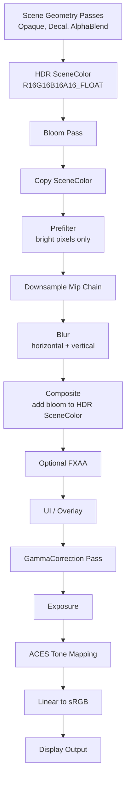
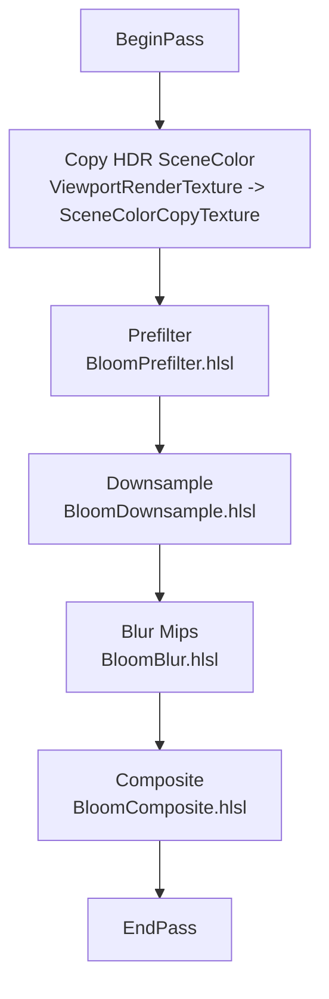
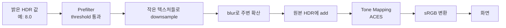

# HDR Bloom 구현 가이드

이 문서는 우리 엔진에서 HDR Bloom을 구현하기 위해 거친 과정과, Bloom / Tone Mapping / ACES의 렌더링 개념을 함께 정리한 가이드다.

버그 분석 기록은 별도 문서인 `Docs/HDRBloomGammaCorrectionPostmortem.md`에 있고, 이 문서는 "어떻게 구현해야 하는가"와 "왜 그런 순서가 필요한가"에 집중한다.

---

## 1. 한 장 요약

Bloom은 밝은 픽셀 주변으로 빛이 번져 보이게 만드는 후처리 효과다.

하지만 Bloom은 단순히 이미지를 흐리게 하는 효과가 아니다. Bloom이 자연스럽게 보이려면 화면 색을 LDR, 즉 `0.0~1.0` 범위에 가둔 뒤 처리하면 안 된다. 먼저 Scene Color를 HDR로 유지하고, `1.0`을 초과하는 밝기 정보를 가진 상태에서 밝은 픽셀을 추출해야 한다.

최종 순서는 다음이 핵심이다.

```text
HDR SceneColor에 장면 렌더
-> 밝은 픽셀 추출
-> 다운샘플 mip chain 생성
-> blur
-> HDR SceneColor에 Bloom 합성
-> Tone Mapping
-> Linear to sRGB
```

가장 중요한 규칙:

> Bloom은 tone mapping 전에 합성한다.  
> Tone mapping과 gamma 변환은 최종 출력 직전에 한 번만 수행한다.

---

## 2. 전체 렌더링 흐름

현재 의도한 렌더링 파이프라인은 다음과 같다.



이 흐름에서 Bloom pass의 위치는 `AlphaBlend` 뒤, `FXAA` 앞이 자연스럽다.

이유는 다음과 같다.

| 위치 | 이유 |
|---|---|
| `AlphaBlend` 뒤 | 투명 파티클, additive particle, billboard sprite도 Bloom 대상이 되어야 한다. |
| `FXAA` 앞 | Bloom으로 새로 생긴 밝은 경계까지 anti-aliasing 대상이 될 수 있다. |
| `GammaCorrection` 앞 | Bloom은 HDR 밝기 기준으로 추출하고 합성해야 한다. |
| UI 앞 또는 뒤는 의도에 따라 선택 | 일반적으로 게임 UI는 Bloom 영향을 받지 않게 Bloom 뒤에 그린다. |

---

## 3. Bloom이란 무엇인가

Bloom은 매우 밝은 물체 주변에 빛이 번져 보이는 현상을 흉내 내는 후처리다.

현실에서는 렌즈, 눈, 카메라 센서, 필름 특성 때문에 강한 빛이 주변 픽셀에 영향을 준다. 게임 렌더링에서는 이를 다음 방식으로 근사한다.

```text
원본 HDR 이미지
-> 밝은 영역만 추출
-> 그 밝은 영역을 크게 흐림
-> 흐린 결과를 원본 이미지에 더함
```

즉 Bloom은 크게 세 가지로 이루어진다.

| 단계 | 역할 |
|---|---|
| Bright extraction | 충분히 밝은 픽셀만 골라낸다. |
| Blur | 골라낸 밝은 픽셀을 주변으로 퍼뜨린다. |
| Composite | 퍼진 빛을 원본 HDR SceneColor에 더한다. |

Bloom은 "밝은 색을 더 진하게 만드는 것"이 아니다. 주변으로 빛이 확산되어야 한다.

그래서 단순히 particle color를 진하게 만드는 것만으로는 Bloom이 아니다. HDR brightness가 threshold를 넘고, prefilter와 blur를 거쳐 composite되어야 실제 빛번짐이 된다.

---

## 4. 왜 HDR SceneColor가 먼저 필요한가

LDR SceneColor는 보통 각 색 채널이 `0.0~1.0` 범위에 clamp된다.

문제는 이렇게 clamp하면 다음 두 픽셀이 구분되지 않는다는 점이다.

```text
흰 벽:       float3(1.0, 1.0, 1.0)
강한 발광체: float3(15.0, 8.0, 2.0)
```

LDR에서는 둘 다 최종적으로 비슷하게 `1.0` 근처로 잘린다. 그러면 Bloom prefilter는 무엇이 정말 강한 빛인지 알 수 없다.

HDR에서는 다음 차이가 보존된다.

```text
일반 흰색:  1.0
밝은 파티클: 3.0
폭발 중심:  20.0
태양:       100.0+
```

이 정보가 있어야 threshold 기반 Bloom이 가능하다.

우리 엔진에서는 SceneColor를 다음 포맷으로 바꿨다.

```cpp
constexpr DXGI_FORMAT SceneColorFormat = DXGI_FORMAT_R16G16B16A16_FLOAT;
```

이 포맷은 half float 기반 HDR render target이다.

| 포맷 | 특징 |
|---|---|
| `R8G8B8A8_UNORM` | 0~1 LDR, 밝은 값이 clamp됨 |
| `R16G16B16A16_FLOAT` | HDR 색 저장 가능, Bloom과 tone mapping에 적합 |

---

## 5. 우리 엔진의 Bloom 리소스 구성

Bloom은 원본 SceneColor를 직접 blur하지 않는다. 대신 별도의 작은 render target chain을 만든다.

현재 구조는 다음과 같다.

```text
FBloomFrameResources
    Mips[0..4]
    TempMips[0..4]
```

각 mip은 `FBloomMipResource`다.

```cpp
struct FBloomMipResource
{
    ID3D11Texture2D* Texture;
    ID3D11RenderTargetView* RTV;
    ID3D11ShaderResourceView* SRV;
    uint32 Width;
    uint32 Height;
};
```

Viewport 크기가 `W x H`라면 Bloom mip 크기는 대략 다음과 같다.

| Mip | 크기 | 역할 |
|---:|---|---|
| 0 | `W/2 x H/2` | 비교적 좁은 glow |
| 1 | `W/4 x H/4` | 중간 glow |
| 2 | `W/8 x H/8` | 넓은 glow |
| 3 | `W/16 x H/16` | 더 넓은 glow |
| 4 | `W/32 x H/32` | 가장 넓은 halo |

작은 texture에서 blur하면 같은 sample count로도 화면상 훨씬 넓은 blur를 얻을 수 있다. 그래서 Bloom은 mip pyramid를 많이 사용한다.

---

## 6. Bloom Pass 내부 단계

현재 `FBloomPass::Execute()`는 대략 다음 순서로 동작한다.



## 6.1 BeginPass: SceneColor 복사

Bloom pass는 먼저 현재 HDR SceneColor를 복사한다.

```cpp
DC->OMSetRenderTargets(0, nullptr, nullptr);
DC->CopyResource(Frame.SceneColorCopyTexture, Frame.ViewportRenderTexture);
```

여기서 `OMSetRenderTargets(0, nullptr, nullptr)`가 중요하다.

D3D11에서는 같은 resource를 render target으로 바인딩한 상태에서 copy source나 shader resource로 쓰면 충돌이 날 수 있다. 그래서 복사 전에 RTV binding을 해제한다.

이 복사본은 prefilter와 composite의 입력으로 쓰인다.

```text
ViewportRenderTexture: 현재 HDR SceneColor, 렌더 타깃
SceneColorCopyTexture: 읽기 전용 복사본, SRV로 샘플링
```

---

## 6.2 Prefilter: 밝은 픽셀만 추출

Bloom의 첫 번째 shader는 `BloomPrefilter.hlsl`이다.

역할은 "밝은 픽셀만 남기고 나머지는 제거"하는 것이다.

핵심 입력:

| 값 | 의미 |
|---|---|
| `Threshold` | 이 밝기 이상부터 Bloom 대상 |
| `SoftKnee` | threshold 근처를 부드럽게 연결하는 범위 |
| `SourceTexelSize` | 주변 sample offset 계산용 |

단순 threshold는 이렇게 생각할 수 있다.

```hlsl
brightness = max(color.r, color.g, color.b);

if (brightness < Threshold)
    bloom = 0;
else
    bloom = color;
```

하지만 이렇게 하면 threshold 경계가 딱 잘려서 어색하다. 그래서 soft knee를 쓴다.

```text
Threshold 아래: 거의 Bloom 없음
Threshold 근처: 부드럽게 Bloom 증가
Threshold 위: Bloom 확실히 적용
```

시각적으로는 다음과 같다.

```text
Bloom Contribution
1.0 |                              ________
    |                         ____/
    |                    ____/
    |               ____/
0.0 |______________/
       dark      threshold     bright
```

우리 shader는 중앙 픽셀과 대각선 주변 4개를 함께 샘플링한다.

```hlsl
float3 bloom = ApplyBloomThreshold(center) * 4.0f;
bloom += ApplyBloomThreshold(topLeft);
bloom += ApplyBloomThreshold(topRight);
bloom += ApplyBloomThreshold(bottomLeft);
bloom += ApplyBloomThreshold(bottomRight);
return float4(bloom * 0.125f, 1.0f);
```

이 단계는 밝은 영역 추출과 약간의 안정화 필터 역할을 같이 한다.

---

## 6.3 Downsample: mip chain 만들기

Prefilter 결과는 `Mips[0]`에 들어간다. 이후 `BloomDownsample.hlsl`로 더 작은 mip을 만든다.

```text
Mips[0] -> Mips[1] -> Mips[2] -> Mips[3] -> Mips[4]
```

Downsample shader는 현재 픽셀과 주변 대각선 샘플을 섞는다.

```hlsl
float3 color = SourceTexture.Sample(center).rgb * 4.0f;
color += SourceTexture.Sample(uv + float2(-t.x, -t.y)).rgb;
color += SourceTexture.Sample(uv + float2( t.x, -t.y)).rgb;
color += SourceTexture.Sample(uv + float2(-t.x,  t.y)).rgb;
color += SourceTexture.Sample(uv + float2( t.x,  t.y)).rgb;
return float4(color * 0.125f, 1.0f);
```

왜 downsample을 하느냐:

1. Blur 비용을 줄인다.
2. 작은 mip은 화면상 큰 blur radius처럼 보인다.
3. 여러 mip을 합성하면 작은 glow와 넓은 halo를 동시에 얻는다.

---

## 6.4 Blur: ping-pong horizontal / vertical

Blur는 `BloomBlur.hlsl`에서 수행한다.

현재 blur는 separable blur 방식이다.

2D blur를 정직하게 하면 `N x N` 샘플이 필요하다.

```text
9x9 blur = 81 samples
```

하지만 Gaussian blur는 수평 blur와 수직 blur로 분리할 수 있다.

```text
9 horizontal samples + 9 vertical samples = 18 samples
```

그래서 다음 방식으로 처리한다.

```text
Mips[i] --horizontal blur--> TempMips[i]
TempMips[i] --vertical blur--> Mips[i]
```

이를 ping-pong blur라고 부른다.

현재 shader는 중심과 양쪽 1~4 offset을 샘플링한다.

```hlsl
float3 color = SourceTexture.Sample(uv).rgb * 0.227027f;
color += SourceTexture.Sample(uv + stepUV * 1.0f).rgb * 0.1945946f;
color += SourceTexture.Sample(uv - stepUV * 1.0f).rgb * 0.1945946f;
...
```

`Radius`는 `stepUV`에 곱해진다.

```hlsl
float2 stepUV = Direction * SourceTexelSize * max(Radius, 0.001f);
```

`BloomBlurRadius`를 올리면 sample 간격이 커지고, 빛 번짐이 더 넓어진다.

---

## 6.5 Composite: 원본 HDR SceneColor에 Bloom 더하기

마지막 단계는 `BloomComposite.hlsl`이다.

Composite shader는 원본 SceneColor와 blur된 mip들을 읽는다.

```hlsl
float4 scene = SceneTexture.SampleLevel(LinearClampSampler, input.uv, 0);

float3 bloom = 0.0f;
bloom += BloomTexture0.SampleLevel(...).rgb * 0.45f;
bloom += BloomTexture1.SampleLevel(...).rgb * 0.25f;
bloom += BloomTexture2.SampleLevel(...).rgb * 0.15f;
bloom += BloomTexture3.SampleLevel(...).rgb * 0.10f;
bloom += BloomTexture4.SampleLevel(...).rgb * 0.05f;

return float4(scene.rgb + bloom * Intensity, scene.a);
```

여기서 중요한 점:

> Composite 결과도 여전히 HDR SceneColor다.

즉 여기서 `saturate()`를 하거나 `0~1`로 clamp하면 안 된다.

Bloom composite 후에도 값은 `1.0`을 초과할 수 있다.

```text
scene.rgb = 2.0
bloom.rgb = 1.5
final HDR = 3.5
```

이 값은 나중에 GammaCorrection pass에서 tone mapping된다.

---

## 7. Particle과 Bloom

파티클이 Bloom을 받으려면 두 가지가 필요하다.

1. 파티클이 Bloom pass 이전에 HDR SceneColor에 그려져야 한다.
2. 파티클 색이 Bloom threshold를 넘을 만큼 밝아야 한다.

현재 Bloom pass는 `AlphaBlend` 뒤에 있으므로, sprite particle과 additive particle이 Bloom 대상이 될 수 있다.

단, "색이 진해졌다"와 "HDR로 threshold를 넘었다"는 다르다.

예를 들어 다음 색은 화면상 매우 빨갛지만 threshold가 1.0이면 Bloom 대상이 아닐 수 있다.

```text
float3(1.0, 0.0, 0.0)
```

반대로 다음 색은 확실한 HDR emissive다.

```text
float3(5.0, 0.4, 0.1)
```

그래서 particle editor 쪽에서 `EmissiveIntensity` 같은 배수를 두는 것이 의미가 있다.

```text
FinalParticleColor = BaseColor * ColorOverLife * EmissiveIntensity
```

권장 감각값:

| 효과 | EmissiveIntensity 예시 |
|---|---:|
| 약한 glow | 1.5~2.0 |
| 마법 spark | 3.0~6.0 |
| 폭발 중심 | 8.0~20.0 |
| 태양/레이저 중심 | 20.0+ |

이 값들은 tone mapping 전의 HDR 값이다. 최종 화면에서는 ACES tone mapping이 보기 좋은 범위로 눌러준다.

---

## 8. Tone Mapping이란 무엇인가

Tone Mapping은 HDR 색을 모니터에 보여줄 수 있는 LDR 색으로 변환하는 과정이다.

렌더링 내부에서는 이런 값이 가능하다.

```text
float3(0.2, 0.2, 0.2)    어두운 벽
float3(1.0, 1.0, 1.0)    흰 종이
float3(4.0, 2.0, 0.5)    밝은 램프
float3(40.0, 30.0, 8.0)  태양 방향
```

하지만 일반 display output은 최종적으로 대략 `0~1` 범위가 필요하다. 이때 단순 clamp를 하면 문제가 생긴다.

```text
clamp(4.0)  -> 1.0
clamp(40.0) -> 1.0
```

램프와 태양이 똑같은 흰색으로 날아가고, highlight detail이 사라진다.

Tone mapping은 이 넓은 HDR 범위를 보기 좋은 LDR 범위로 압축한다.

```text
0.0 -------------------- 1.0 -------------------- 10.0 -------------------- 100.0 HDR
 |                         |                         |                          |
 v                         v                         v                          v
0.0                      0.8                       0.96                       0.995 LDR
```

즉 tone mapping의 역할은 "밝은 값을 없애는 것"이 아니라 "밝은 값을 디스플레이 가능한 범위로 부드럽게 압축하는 것"이다.

---

## 9. Exposure란 무엇인가

Exposure는 tone mapping 전에 HDR 값을 전체적으로 키우거나 줄이는 배율이다.

현재 GammaCorrection shader에서는 다음 순서로 적용한다.

```hlsl
hdrColor = max(hdrColor, 0.0f) * max(Exposure, 0.0f);
return ACESFilm(hdrColor);
```

Exposure를 올리면 전체 이미지가 밝아지고, Bloom도 더 강하게 느껴질 수 있다. 그러나 Bloom threshold 자체는 Bloom pass에서 이미 적용되므로, exposure는 최종 display mapping 쪽 영향이 더 크다.

```text
Exposure 낮음: 어둡고 highlight가 덜 튐
Exposure 높음: 밝고 highlight가 빠르게 roll-off됨
```

주의할 점:

> Exposure는 Bloom threshold를 대체하지 않는다.  
> Bloom 대상 선정은 Bloom pass의 HDR SceneColor 기준으로 이루어진다.

---

## 10. Gamma Correction과 Linear to sRGB

렌더링 계산은 보통 linear color space에서 수행한다.

```text
linear 0.5 + linear 0.5 = linear 1.0
```

이것이 물리적으로 자연스러운 계산이다.

하지만 모니터와 이미지 표시 시스템은 일반적으로 sRGB 공간을 기대한다. 그래서 최종 출력 직전에 linear color를 sRGB로 바꿔야 한다.

우리 shader의 `LinearToSRGB()`는 낮은 값과 높은 값을 나누어 처리한다.

```hlsl
float3 low = color * 12.92f;
float3 high = 1.055f * pow(color, 1.0f / safeGamma) - 0.055f;
return lerp(low, high, step(0.0031308f, color));
```

여기서 중요한 순서:

```text
HDR linear color
-> tone mapping
-> LDR linear color
-> linear to sRGB
-> display
```

Gamma correction은 tone mapping의 대체물이 아니다.

| 과정 | 입력 | 출력 | 목적 |
|---|---|---|---|
| Tone Mapping | HDR linear | LDR linear | 넓은 밝기 범위를 압축 |
| Gamma / sRGB 변환 | LDR linear | LDR sRGB | 화면 표시용 색 공간 변환 |

---

## 11. ACES란 무엇인가

ACES는 Academy Color Encoding System의 약자다.

정확한 ACES는 영화 제작 파이프라인 전체를 다루는 색 관리 시스템이다. 여기에는 카메라 입력, 작업 색공간, reference rendering transform, output transform 등이 포함된다.

게임에서 흔히 말하는 "ACES tone mapping"은 전체 ACES 시스템을 완전히 구현했다는 뜻이 아니라, ACES의 filmic highlight rolloff 느낌을 근사하는 tone mapping curve를 쓴다는 뜻에 가깝다.

우리 shader의 함수도 이런 "ACES filmic approximation"이다.

```hlsl
float3 ACESFilm(float3 color)
{
    const float A = 2.51f;
    const float B = 0.03f;
    const float C = 2.43f;
    const float D = 0.59f;
    const float E = 0.14f;
    return saturate((color * (A * color + B)) / (color * (C * color + D) + E));
}
```

이 식은 밝은 값을 부드럽게 눌러준다.

```text
LDR Output
1.0 |                         _________
    |                     ___/
    |                  __/
    |              ___/
    |          ___/
0.0 |_________/
       0      1      2      4      8      HDR Input
```

ACES류 curve의 장점:

| 장점 | 설명 |
|---|---|
| Highlight rolloff | 밝은 영역이 갑자기 흰색으로 잘리지 않고 부드럽게 눌린다. |
| Filmic contrast | 단순 Reinhard보다 대비가 보기 좋게 유지되는 경우가 많다. |
| Bloom과 궁합이 좋음 | Bloom으로 커진 HDR 값을 자연스럽게 화면 범위로 압축한다. |
| 파라미터가 단순함 | Exposure 하나만으로도 꽤 다루기 쉽다. |

단점:

| 단점 | 설명 |
|---|---|
| 정확한 ACES 전체 구현은 아님 | 색 관리 시스템 전체가 아니라 tone curve 근사다. |
| 채도가 변할 수 있음 | 매우 밝은 색에서 색감이 눌리거나 변할 수 있다. |
| art direction 필요 | Bloom threshold, intensity, exposure를 함께 맞춰야 한다. |

---

## 12. Reinhard, Exponential, ACES 비교

대표적인 tone mapping 방식은 다음과 같다.

| 방식 | 식 예시 | 특징 |
|---|---|---|
| Clamp | `saturate(color)` | 가장 나쁨. highlight detail이 즉시 사라진다. |
| Reinhard | `color / (1 + color)` | 단순하고 안정적이지만 다소 회색빛으로 눌릴 수 있다. |
| Exponential | `1 - exp(-color * exposure)` | 노출 느낌이 직관적이고 부드럽다. |
| ACES Filmic | rational curve | highlight rolloff와 contrast가 좋아 게임에서 자주 쓰인다. |

감각적으로는 다음과 같다.

```text
Clamp:       밝은 값이 전부 흰색으로 잘림
Reinhard:    안전하지만 조금 평평함
Exponential: 카메라 노출처럼 부드러움
ACES:        filmic contrast와 highlight rolloff가 좋음
```

우리 엔진은 현재 ACES Filmic curve를 사용한다.

---

## 13. 왜 Bloom은 Tone Mapping 전에 합성해야 하는가

Bloom은 HDR 밝기 정보를 기반으로 해야 한다.

다음 두 순서를 비교해보자.

### 잘못된 순서

```text
HDR SceneColor
-> Tone Mapping
-> LDR SceneColor
-> Bloom
```

이 경우 tone mapping이 이미 밝은 값을 `0~1`로 눌러버린다.

```text
20.0 HDR -> 0.98 LDR
4.0 HDR  -> 0.90 LDR
1.0 HDR  -> 0.80 LDR
```

Bloom prefilter가 볼 때 값들이 다 비슷해진다. 강한 빛과 보통 밝은 표면을 구분하기 어려워진다.

### 올바른 순서

```text
HDR SceneColor
-> Bloom Prefilter / Blur / Composite
-> Tone Mapping
-> sRGB
```

이 경우 Bloom은 다음 값을 그대로 볼 수 있다.

```text
20.0 HDR: 강한 Bloom
4.0 HDR:  중간 Bloom
1.0 HDR:  threshold에 따라 Bloom 없음
```

그리고 마지막 Tone Mapping이 Bloom까지 포함한 HDR 결과를 보기 좋은 LDR 화면으로 압축한다.

---

## 14. 현재 엔진 파일별 역할

| 파일 | 역할 |
|---|---|
| `KraftonEngine/Source/Engine/Viewport/Viewport.cpp` | HDR SceneColor, SceneColorCopyTexture, Bloom mip resources 생성 |
| `KraftonEngine/Source/Engine/Render/Types/BloomTypes.h` | Bloom mip resource 구조 정의 |
| `KraftonEngine/Source/Engine/Render/RenderPass/BloomPass.cpp` | Bloom pass 전체 실행 |
| `KraftonEngine/Shaders/PostProcess/BloomPrefilter.hlsl` | 밝은 픽셀 추출 |
| `KraftonEngine/Shaders/PostProcess/BloomDownsample.hlsl` | Bloom mip chain 생성 |
| `KraftonEngine/Shaders/PostProcess/BloomBlur.hlsl` | separable blur |
| `KraftonEngine/Shaders/PostProcess/BloomComposite.hlsl` | HDR SceneColor에 Bloom 합성 |
| `KraftonEngine/Shaders/PostProcess/GammaCorrection.hlsl` | Exposure, ACES tone mapping, sRGB 변환 |
| `KraftonEngine/Source/Engine/Render/Command/DrawCommandList.cpp` | render pass별 command 정렬 및 실행 |
| `KraftonEngine/Source/Engine/Render/Command/DrawCommand.h` | SortKey bit layout |
| `KraftonEngine/Source/Engine/Render/Command/DrawCommandBuilder.cpp` | 후처리 command 생성 |
| `KraftonEngine/Source/Editor/UI/Toolbar/ViewportToolbar.cpp` | Bloom/Gamma UI 슬라이더 |
| `KraftonEngine/Source/Editor/UI/Asset/Particle/ParticleSystemEditorWidget.cpp` | Particle editor preview의 Bloom/Gamma 설정 |

---

## 15. 구현 순서 회고

이번 Bloom 구현은 다음 순서로 진행했다.

### 1단계: SceneColor를 HDR로 전환

Bloom을 하려면 SceneColor가 HDR 값을 저장해야 한다.

그래서 viewport render target 포맷을 다음으로 변경했다.

```cpp
DXGI_FORMAT_R16G16B16A16_FLOAT
```

이 단계의 목표는 파티클이나 emissive material이 `1.0`을 초과하는 값을 화면 버퍼에 남길 수 있게 만드는 것이다.

### 2단계: Bloom render pass 추가

`ERenderPass::Bloom`을 추가하고, enum 순서상 `AlphaBlend` 뒤와 `FXAA` 앞에 배치했다.

이유:

```text
AlphaBlend particle까지 Bloom 대상
FXAA 전에 Bloom 결과 생성
GammaCorrection 전에는 반드시 Bloom 완료
```

### 3단계: Bloom RT / mip resource 추가

Viewport가 Bloom용 `Mips`와 `TempMips`를 소유하게 했다.

각 mip은 RTV와 SRV를 모두 가진다.

```text
RTV: pass output으로 쓰기
SRV: 다음 pass input으로 읽기
```

### 4단계: Prefilter / Downsample / Blur / Composite shader 추가

Bloom shader는 네 종류로 나누었다.

| Shader | 역할 |
|---|---|
| `BloomPrefilter` | threshold 기반 밝은 픽셀 추출 |
| `BloomDownsample` | mip chain 생성 |
| `BloomBlur` | horizontal / vertical blur |
| `BloomComposite` | 원본 HDR에 Bloom 합성 |

### 5단계: GammaCorrection을 Tone Mapping pass로 확장

기존 GammaCorrection은 linear color를 sRGB로 바꾸는 역할만 했다.

HDR Bloom을 넣은 뒤에는 `1.0` 초과 값이 생기므로 tone mapping이 먼저 필요해졌다.

그래서 GammaCorrection pass를 다음 역할로 확장했다.

```text
HDR SceneColor
-> Exposure 적용
-> ACES Filmic Tone Mapping
-> Linear to sRGB
```

### 6단계: Particle emissive intensity 연결

파티클이 Bloom threshold를 넘을 수 있도록 emissive intensity 개념을 열었다.

Bloom은 "additive 전용"이 아니라, 최종 HDR SceneColor에서 충분히 밝은 픽셀이면 대상이 된다.

즉 다음이 핵심이다.

```text
파티클 렌더 방식보다 중요한 것:
최종 HDR SceneColor 값이 BloomThreshold보다 큰가?
```

### 7단계: Render pass 정렬 버그 해결

마지막으로 `GammaCorrection`을 켜면 Bloom이 사라지는 문제가 있었다.

원인은 Bloom shader가 아니라 render command sorting이었다.

`GammaCorrection` enum 값이 16인데 SortKey가 pass를 4비트만 저장해서 pass ordering이 깨졌다.

수정:

```cpp
// 기존
Key |= (static_cast<uint64>(InPass) & 0xF) << 60;

// 수정
Key |= (static_cast<uint64>(InPass) & 0x1F) << 59;
```

그리고 sort 비교 함수에서 pass를 명시적으로 먼저 비교하게 했다.

```cpp
if (A.Pass != B.Pass)
{
    return static_cast<uint32>(A.Pass) < static_cast<uint32>(B.Pass);
}
```

---

## 16. Bloom 파라미터 감각

현재 주요 설정은 다음과 같다.

| 파라미터 | 의미 | 낮으면 | 높으면 |
|---|---|---|---|
| `BloomThreshold` | Bloom 대상이 되는 최소 밝기 | 더 많은 영역이 Bloom | 아주 밝은 것만 Bloom |
| `BloomSoftKnee` | threshold 경계 부드러움 | 경계가 딱딱함 | 자연스럽게 전환 |
| `BloomIntensity` | 합성 강도 | 은은함 | 강한 빛번짐 |
| `BloomBlurRadius` | blur sample 간격 | 좁은 glow | 넓은 glow |
| `Exposure` | tone mapping 전 밝기 배율 | 어두움 | 밝음 |
| `Gamma` | sRGB 변환 curve | 어두운 톤 변화 | 밝은 톤 변화 |

Particle preview 기본값은 다음 방향이 좋다.

```cpp
BloomThreshold = 0.8f;
BloomIntensity = 1.2f;
BloomBlurRadius = 2.0f;
```

작업할 때 추천 조정 순서:

1. 먼저 `EmissiveIntensity`를 올려 particle이 threshold를 넘게 한다.
2. `BloomThreshold`로 Bloom 대상 범위를 정한다.
3. `BloomIntensity`로 전체 강도를 맞춘다.
4. `BloomBlurRadius`로 퍼지는 폭을 맞춘다.
5. 마지막으로 `Exposure`로 전체 화면 밝기를 조정한다.

---

## 17. 흔한 문제와 진단법

| 증상 | 가능 원인 | 확인 |
|---|---|---|
| Bloom이 전혀 안 보임 | HDR 값이 threshold를 넘지 않음 | emissive intensity를 크게 올려보기 |
| Gamma를 켜면 Bloom이 사라짐 | pass order, SceneColor copy, tone mapping 순서 문제 | command sort와 pass range 확인 |
| 화면 전체가 뿌옇게 됨 | threshold가 너무 낮음 | `BloomThreshold` 올리기 |
| Bloom이 너무 좁음 | blur radius 또는 mip contribution 부족 | `BloomBlurRadius` 올리기 |
| 밝은 부분이 흰 덩어리로 날아감 | tone mapping 부재 또는 clamp | GammaCorrection pass 확인 |
| D3D11 RTV slot 경고 | MRT shader가 single-RT pass에서 사용됨 | UberLit color-only permutation 확인 |
| shader 생성 크래시 | invalid shader가 material template까지 전달됨 | ShaderManager/MaterialManager null guard 확인 |

---

## 18. 디버깅용 강제 테스트 값

Bloom이 작동하는지 빠르게 보고 싶으면 다음 조건을 만든다.

```text
Particle color: float3(1, 0.4, 0.1)
EmissiveIntensity: 10
BloomThreshold: 0.8
BloomIntensity: 2.0
BloomBlurRadius: 2.5
Exposure: 1.0
GammaCorrection: On
```

이 상태에서 Bloom이 안 보이면 색감 문제가 아니라 pipeline 문제일 가능성이 높다.

확인 순서:

1. Particle이 `AlphaBlend` 또는 Bloom 이전 pass에서 그려지는가?
2. SceneColor가 `R16G16B16A16_FLOAT`인가?
3. Bloom pass가 실행되는가?
4. Prefilter 결과 mip에 값이 생기는가?
5. Composite가 ViewportRTV에 쓰는가?
6. GammaCorrection이 composite 후 SceneColor를 읽는가?
7. DrawCommandList pass sorting이 enum 순서를 지키는가?

---

## 19. 구현상 주의해야 할 D3D11 상태

후처리 pass에서는 SRV와 RTV 충돌을 조심해야 한다.

잘못된 예:

```text
SceneColor를 RTV로 바인딩한 채
SceneColor를 SRV로 읽거나 CopyResource source로 사용
```

올바른 예:

```cpp
DC->OMSetRenderTargets(0, nullptr, nullptr);
DC->CopyResource(SceneColorCopyTexture, ViewportRenderTexture);
DC->OMSetRenderTargets(1, &ViewportRTV, ViewportDSV);
```

Bloom 내부 pass도 마찬가지다. 어떤 texture를 SRV로 읽으면서 동시에 RTV로 쓰면 안 된다.

그래서 Bloom pass는 다음을 지킨다.

```text
읽기: SourceSRV
쓰기: TargetRTV
읽기/쓰기 대상은 항상 다르게 유지
pass 전후 사용한 SRV는 null로 unbind
```

---

## 20. 최종 mental model

Bloom을 구현할 때 머릿속 모델은 다음이면 충분하다.



이 모델에서 절대 바뀌면 안 되는 규칙:

```text
Bloom은 HDR에서 한다.
Tone Mapping은 Bloom 뒤에 한다.
Gamma/sRGB 변환은 마지막에 한다.
```

---

## 21. 다음 개선 후보

현재 Bloom은 기본 구조가 잡힌 상태다. 앞으로 품질을 올리려면 다음을 고려할 수 있다.

| 개선 | 설명 |
|---|---|
| Dirt texture | 렌즈 오염 효과를 Bloom에 곱해 cinematic look 추가 |
| Anamorphic bloom | 가로 방향으로 긴 렌즈 flare 느낌 |
| Better upsample chain | 단순 composite 대신 mip을 순차 upsample하며 합성 |
| Temporal stability | 카메라 이동 시 flicker 줄이기 |
| Per-material emissive | mesh material도 명시적 emissive color/intensity 지원 |
| Bloom debug view | prefilter/mip/composite 결과를 viewport에서 시각화 |
| Auto exposure | 화면 평균 밝기 기반 exposure 자동 조절 |

---

## 22. 핵심 요약

Bloom 구현의 본질은 다음 한 문장으로 요약할 수 있다.

> HDR SceneColor에 남아 있는 "1.0보다 밝은 정보"를 뽑아서, 여러 해상도에서 흐린 뒤, tone mapping 전에 다시 HDR SceneColor에 더하는 것.

Tone Mapping은 다음 한 문장으로 요약할 수 있다.

> HDR의 넓은 밝기 범위를 모니터가 보여줄 수 있는 LDR 범위로 보기 좋게 압축하는 것.

ACES는 다음 한 문장으로 요약할 수 있다.

> 밝은 영역이 갑자기 하얗게 잘리지 않도록 filmic하게 눌러주는 tone mapping curve의 한 종류.

우리 엔진의 최종 구조:

```text
R16G16B16A16_FLOAT SceneColor
-> Bloom Prefilter / Downsample / Blur / Composite
-> ACES Tone Mapping
-> Linear to sRGB
-> Display
```

